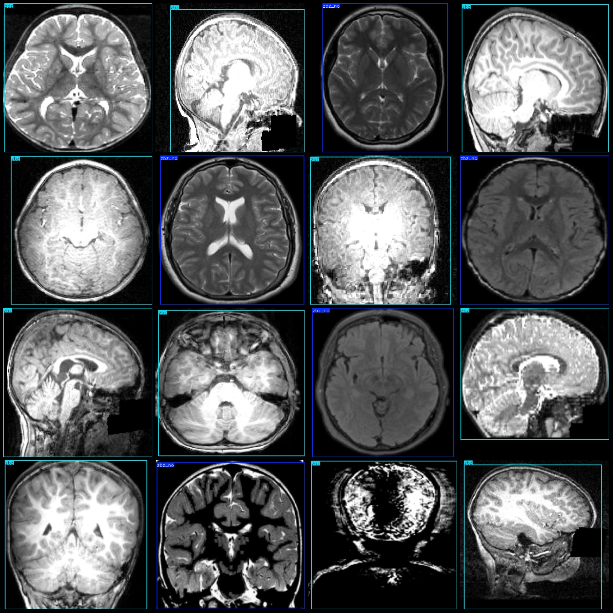

# Smart Health Medical MRI Autism Detection Dataset VOC+YOLO Format, 999 Images in 2 Categories

Dataset Format: Pascal VOC format + YOLO format (txt files without segmentation paths, only containing jpg images along with their corresponding VOC-format xml files and YOLO-format txt files)
Number of Images (jpg file count): 999
Number of Annotations (xml file count): 999
Number of Annotations (txt file count): 999
Number of Annotation Categories: 2
Annotation Category Names (note that the order of categories in the yolo format is not consistent with this, but according to the labels folder's classes.txt): ["zbz", "zbz_no"]
Each category has the number of bounding boxes:
zbz (Autism) = 602
zbz_no (No autism) = 397
Total bounding box count: 999
Each category occupies the number of images:
zbz (Autism) = 602
zbz_no (No autism) = 397
Image resolution: 640x640
Annotation tool used: labelImg
Annotation rules: draw bounding boxes for each category
Important Notice: The dataset does not have been split into training, validation, or test sets; you need to do it yourself.
Special Notice: This dataset does not guarantee the accuracy of the trained models or weight files.
Image Preview:
Annotation Example:

## Images

Here is a pay link on Stripe ( https://buy.stripe.com/3cs8yP7sY87d0vu9AB ). Please contact me lonlonago@foxmail.com after funding $89, and I will send you a complete data files , thank you!

